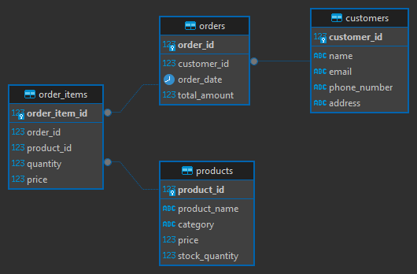

# E-Commerce-Database-Management-and-Analysis

This is an SQL Project for E-Commerce Database Management and Analysis. The project involves designing a relational database for an e-commerce platform, performing data manipulations, and extracting meaningful insights using SQL queries. The task is to design, implement, and query an SQL database for an e-commerce platform.

<a name="readme-top"></a>

## Schema Design Analysis



The schema represents a relational database designed for managing e-commerce transactions. It emphasizes clarity, normalization, and efficient data retrieval, supporting operations related to orders, customers, products, and their relationships. Below is an overview and detailed breakdown of the schema's design principles and components optimised for transactional workflows.

---

### 1. Key Entities and Relationships

1. **Customers:**
   - The `customers` table captures essential user information, including:
     - **Unique identifier** (`customer_id`): Ensures distinct identification of each customer.
     - **Attributes**: Name, email, phone number, and address for customer communication and record-keeping.
   - **Primary Purpose**: Acts as the core entity for user data, linking directly to orders.

2. **Orders:**
   - The `orders` table contains transaction-specific data:
     - **Unique identifier** (`order_id`): Distinct key for each order.
     - **Foreign Key** (`customer_id`): Establishes the relationship between orders and their respective customers.
     - **Attributes**: `order_date` and `total_amount` for operational and analytical purposes.
   - **Primary Purpose**: Central entity for managing transactional workflows.

3. **Order_Items:**
   - The `order_items` table provides a many-to-one mapping between orders and products:
     - **Composite Foreign Keys**: Links to `orders` (`order_id`) and `products` (`product_id`).
     - **Attributes**: Includes quantity and price to track revenue details.
   - **Primary Purpose**: Supports detailed order line items for each transaction.

4. **Products:**
   - The `products` table catalogs all available inventory:
     - **Unique identifier** (`product_id`): Primary key for each product.
     - **Attributes**: Includes `product_name`, `category`, `price`, and `stock_quantity`.
   - **Primary Purpose**: Serves as a reference entity for managing product details.

---

### 2. Design Principles

1. **Normalization:**
   - The schema adheres to **third normal form (3NF)**, ensuring minimal redundancy:
     - Customer and product details are stored in separate tables and referenced via foreign keys.
     - Transactional details are isolated in `orders` and `order_items`, enabling granular tracking.

2. **Referential Integrity:**
   - All relationships are enforced through **foreign key constraints**, ensuring data consistency:
     - Orders are linked to valid customers via `customer_id`.
     - Each product in an order is referenced accurately through `product_id`.

3. **Scalability:**
   - The schema design supports horizontal scalability:
     - Additional product attributes (e.g., descriptions, supplier data) can be easily added.
     - High-frequency operations (e.g., fetching a customer's order history) are optimized through clear relationships.

4. **Operational Efficiency:**
   - The schema design supports:
     - **Efficient query execution**: Indexed fields such as `customer_id`, `order_id`, and `product_id` ensure fast lookups.
     - **Aggregate operations**: Simplifies analysis, such as total revenue by customer or product.

---

### 3. Use Case Application

1. **E-Commerce Operations:**
   - Manage customer orders and track product inventory efficiently.
   - Support detailed insights into customer spending patterns and product sales performance.

---

### 4. Recommendations for Enhancement

1. **Indexing Strategy:**
   - Create indexes on frequently queried fields such as `customer_id`, `order_id`, and `product_id` to optimize performance for analytical queries.

---

## Queries

### Retrieve All Orders Made by a Specific Customer

This query will return all the orders placed by Emma Wilson (Customer ID 5), including the order_id, order_date, and total_amount.

```sql
SELECT o.order_id, o.order_date, o.total_amount 
FROM Orders o
JOIN Customers c ON o.customer_id = c.customer_id
WHERE c.customer_id = 5;
```

|order_id|order_date|total_amount|
|--------|----------|------------|
|7|2024-01-30 09:05:00.000|359.97|
|30|2024-05-12 16:50:00.000|359.97|
|50|2024-09-18 11:20:00.000|359.97|
|70|2024-12-23 11:30:00.000|359.97|

### Revenue Analysis

- Calculate the total revenue generated by the e-commerce platform

This query calculates the total revenue by summing up the product of the price and quantity columns from the Order_Items table.

```sql
SELECT SUM(price * quantity) AS total_revenue
FROM Order_Items;
```

|total_revenue|
|-------------|
|17449.01|

- Find the revenue generated per product

This query joins the Order_Items and Products tables to retrieve product names, groups the data by `product_id` and `product_name`,
calculates the total revenue for each product by summing `price * quantity`, and orders the results in descending order to highlight the most profitable products.

```sql
SELECT 
    p.product_id,
    p.product_name,
    SUM(oi.price * oi.quantity) AS revenue
FROM Order_Items oi
JOIN Products p ON oi.product_id = p.product_id
GROUP BY p.product_id, p.product_name
ORDER BY revenue DESC;
```

|product_id|product_name|revenue|
|----------|------------|-------|
|1|Laptop|5799.94|
|4|Smartphone|4149.94|
|6|Gaming Chair|1099.92|
|18|Washing Machine|799.99|
|9|Smartwatch|739.93|
|3|Coffee Maker|559.93|
|7|Bluetooth Speaker|549.94|
|10|Keyboard|539.94|
|2|Headphones|449.91|
|11|Electric Kettle|399.96|
|19|Printer|359.96|
|16|Shredder|339.96|
|5|Wireless Mouse|339.87|
|8|Air Purifier|299.97|
|13|Tablet|279.97|
|17|Vitamins|239.96|
|15|Electric Toothbrush|219.96|
|14|Office Chair|169.99|
|12|Desk Lamp|109.97|

### Customer Insights

- List the top 5 customers by total spending.

```sql
SELECT 
    c.customer_id,
    c.name,
    c.email,
    SUM(o.total_amount) AS total_spending
FROM Customers c
JOIN Orders o ON c.customer_id = o.customer_id
GROUP BY c.customer_id, c.name, c.email
ORDER BY total_spending DESC
LIMIT 5;
```

|customer_id|name|email|total_spending|
|-----------|----|-----|--------------|
|4|David Johnson|david.j@example.com|5199.92|
|17|Quinn Evans|quinn.e@example.com|4799.94|
|10|Jack Baker|jack.b@example.com|4499.91|
|18|Ruby Kelly|ruby.k@example.com|3899.94|
|1|Alice Smith|alice@example.com|3849.88|

- Identify customers who haven’t made any purchases

```sql
SELECT 
    c.customer_id,
    c.name,
    c.email
FROM Customers c
LEFT JOIN Orders o ON c.customer_id = o.customer_id
WHERE o.order_id IS NULL;
```

|customer_id|name|email|
|-----------|----|-----|
|24|John Doe|john.doe@example.com|

### Product Trends

- Find the top 3 best-selling products

```sql
SELECT 
    p.product_name,
    SUM(oi.quantity) AS total_quantity_sold
FROM Order_Items oi
JOIN Products p ON oi.product_id = p.product_id
GROUP BY p.product_id, p.product_name
ORDER BY total_quantity_sold DESC
LIMIT 3;
```

|product_name|total_quantity_sold|
|------------|-------------------|
|Wireless Mouse|13|
|Headphones|9|
|Gaming Chair|8|

- Identify products that are out of stock

```sql
SELECT 
    product_id,
    product_name,
    category
FROM Products
WHERE stock_quantity = 0;
```

|product_id|product_name|category|
|----------|------------|--------|
|39|Monitor|Electronics|
|40|Blender|Appliances|
|41|Fitness Tracker|Health|

### Order Details

- Retrieve all items in a specific order, including product names, quantities, and prices. The specific order item being electric kettle.

```sql
SELECT 
    oi.order_item_id,
    p.product_name,
    oi.quantity,
    oi.price
FROM Order_Items oi
JOIN Products p ON oi.product_id = p.product_id
WHERE oi.order_id = 9;
```

|order_item_id|product_name|quantity|price|
|-------------|------------|--------|-----|
|9|Electric Kettle|1|49.99|

- Calculate the total amount of an order

```sql
SELECT 
    oi.order_id,
    SUM(oi.price * oi.quantity) AS total_amount
FROM Order_Items oi
WHERE oi.order_id = 9
GROUP BY oi.order_id;
```

|order_id|total_amount|
|--------|------------|
|9|49.99|

### Monthly Trends

- Calculate the number of orders and total revenue for each month.

```sql
SELECT 
    TO_CHAR(o.order_date, 'YYYY-MM') AS month,                       -- Format the order_date to 'YYYY-MM'
    TO_CHAR(o.order_date, 'Month') AS month_name,
    COUNT(o.order_id) AS total_orders,                               -- Count the number of orders
    SUM(oi.price * oi.quantity) AS total_revenue                     -- Calculate the total revenue
FROM Orders o
JOIN Order_Items oi ON o.order_id = oi.order_id                      -- Join Orders and Order_Items to aggregate revenue
GROUP BY 
    TO_CHAR(o.order_date, 'YYYY-MM'), TO_CHAR(o.order_date, 'Month') -- Group by the formatted month
ORDER BY month;
```

|month|month_name|total_orders|total_revenue|
|-----|----------|------------|-------------|
|2024-01|January  |7|2349.90|
|2024-02|February |7|2519.89|
|2024-03|March    |7|1529.92|
|2024-04|April    |4|439.96|
|2024-05|May      |8|1399.90|
|2024-06|June     |6|2529.90|
|2024-07|July     |4|1109.94|
|2024-08|August   |5|639.92|
|2024-09|September|7|919.90|
|2024-10|October  |6|1499.92|
|2024-11|November |4|1309.94|
|2024-12|December |5|1199.92|

---

## 💡Key Findings and Insights

- Top Performing Products
The `Laptop` and `Smartphone` were the `highest revenue-generating products`, contributing significantly to the platform’s financial performance.

- Revenue Distribution
The dataset shows diverse revenue generation across different products, with some items like the `Electric Kettle` contributing `lower revenues`, while `high-ticket items` like the `Laptop` and `Smartphone` dominate.

- Customer Behavior
Insights into customer spending reveal that a select few customers contribute significantly to overall sales. For example, David Johnson and Quinn Evans topped the list with substantial spending (\$ 5,199.92 and \$ 4,799.94 respectively).

- Product Trends
The best-selling products in terms of quantity sold were `wireless mouse`, `headphones` and `gaming chair`. It is interesting to note that gaming chair is also amongst the top 3 product with a revenue of \$ 1,099.92.

- Sales Trends
Monthly Trends indicate fluctuating sales, with peaks in `February` and `June`, and declines in `April` and `August`, providing valuable insights for inventory and marketing strategies.

---

## LIMITATION

The dataset used in this project has been generated solely for illustrative and educational purposes. All data, including names, email addresses, and other information, is entirely fictitious and does not correspond to any real individuals, organizations, or entities.  

Please note that financial figures across different tables may not reconcile or align. These inconsistencies are intentional and reflect the random nature of the data generation process, designed to simulate real-world data complexities.  

This dataset is not intended for any real-world application or decision-making and should be used exclusively for project demonstration and learning exercises.

However, the concepts and sql queries are applicable to the real-world.

## Contributions

### How to Contribute

1. Fork the repository and clone it to your local machine.
2. Explore the Jupyter Notebooks and documentation.
3. Implement enhancements, fix bugs, or propose new features.
4. Submit a pull request with your changes, ensuring clear descriptions and documentation.
5. Participate in discussions, provide feedback, and collaborate with the community.

<p align="right">(<a href="#readme-top">back to top</a>)</p>

## Feedback and Support

Feedback, suggestions, and contributions are welcome! Feel free to open an issue for bug reports, feature requests, or general inquiries. For additional support or questions, you can connect with me on [LinkedIn](https://www.linkedin.com/in/dr-gabriel-okundaye).

<p align="right">(<a href="#readme-top">back to top</a>)</p>

## 👥 Authors <a name="authors"></a>

🕺🏻**Gabriel Okundaye**

- GitHub: [GitHub Profile](https://github.com/D0nG4667)

- LinkedIn: [LinkedIn Profile](https://www.linkedin.com/in/dr-gabriel-okundaye)

<p align="right">(<a href="#readme-top">back to top</a>)</p>

## ⭐️ Show your support <a name="support"></a>

If you like this project kindly show some love, give it a 🌟 **STAR** 🌟. Thank you!

<p align="right">(<a href="#readme-top">back to top</a>)</p>

## 📝 License <a name="license"></a>

This project is [MIT](/LICENSE) licensed.

<p align="right">(<a href="#readme-top">back to top</a>)</p>
